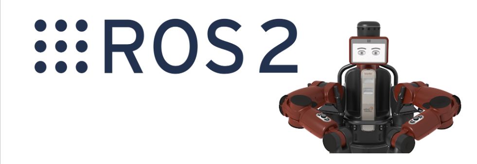

# BringBackBaxter




ROS 2 port of the Baxter robot SDK and MoveIt2 integration. Requires the [Baxter Bridge](https://github.com/RethoughtRobotics/baxter-zenoh) to be running.

---

```bash
git clone git@github.com:RethoughtRobotics/BaxterSDK.git
```

```bash
cd ~/BaxterSDK/ros2_ws
```

## 1. One-time setup

**Install dependencies**

```bash
rosdep install --from-paths src --ignore-src -r -y
```

**Build**

```bash
colcon build
source install/setup.bash
```

---

## 2. Each session

**Start the bridge first** (in a separate terminal, see [Baxter Bridge](https://github.com/RethoughtRobotics/baxter-zenoh))

**Source the workspace**

```bash
source install/setup.bash
```

**Launch MoveIt2 with RViz**

```bash
ros2 launch baxter_moveit_config real_robot.launch.py
```

**Enable the robot**

```bash
ros2 run baxter_interface robot_enable
```

---

## 3. Examples

```bash
# Joint position file playback
ros2 run baxter_examples joint_position_file_playback -f <file>

# Joint recorder
ros2 run baxter_examples joint_recorder -f <file> -t <duration>

# Head wobbler
ros2 run baxter_examples head_wobbler

# Gripper cuff control
ros2 run baxter_examples gripper_cuff_control
```

---

## 4. Architecture

```
Baxter Robot (ROS 1)
        |
  [Baxter Bridge]   ← baxter-zenoh container (Zenoh / ros1_bridge)
        |
   ROS 2 topics     /robot/joint_states, /robot/limb/*/joint_command, ...
        |
  [baxter_interface] ← Python SDK layer (limb, gripper, head, camera, ...)
        |
  [baxter_moveit_config] ← MoveIt2 move_group + RViz
```

---

## FAQ

<details>
<summary><b>MoveIt can't connect to the robot</b></summary>

Make sure the Baxter Bridge is running and you have sourced the workspace:

```bash
source install/setup.bash
ros2 topic echo /robot/joint_states
```

If no messages appear, check the bridge first.

</details>

<details>
<summary><b>Robot won't enable</b></summary>

The robot must be in a safe state (e-stop released, no faults). Check the head display for error indicators, then:

```bash
ros2 run baxter_interface robot_enable
```

</details>

<details>
<summary><b>Building the docs</b></summary>

```bash
sphinx-build -b html docs docs/_build/html
xdg-open docs/_build/html/index.html
```

</details>
